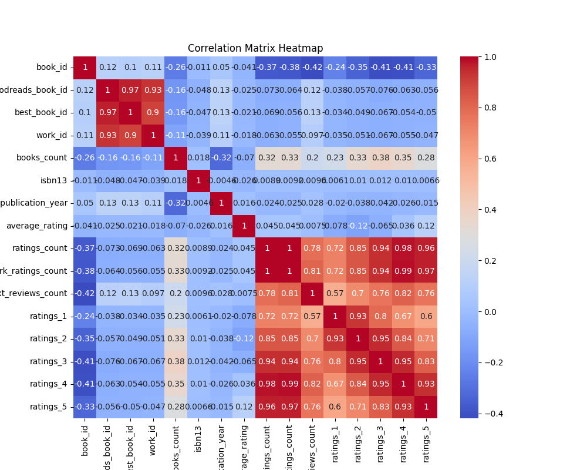
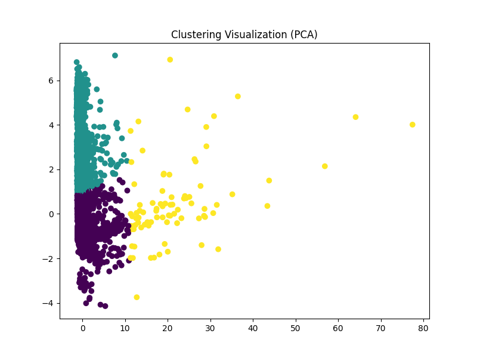
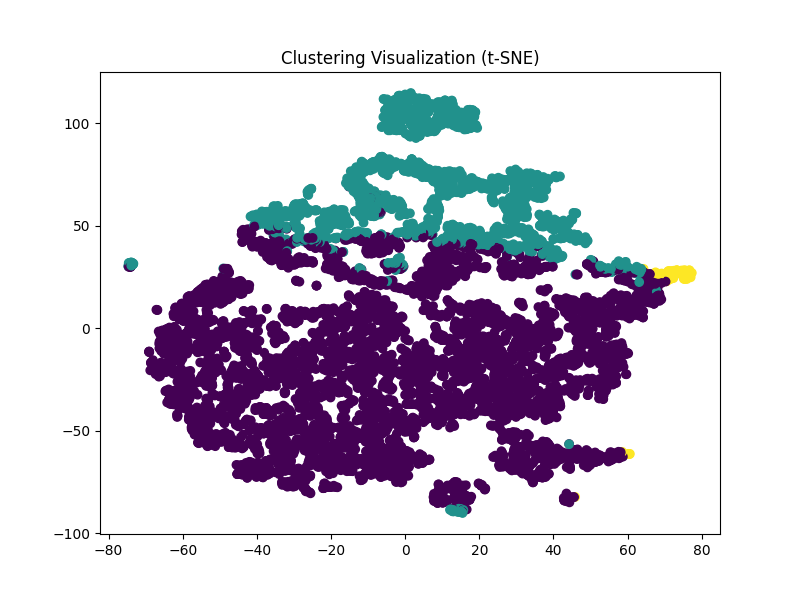
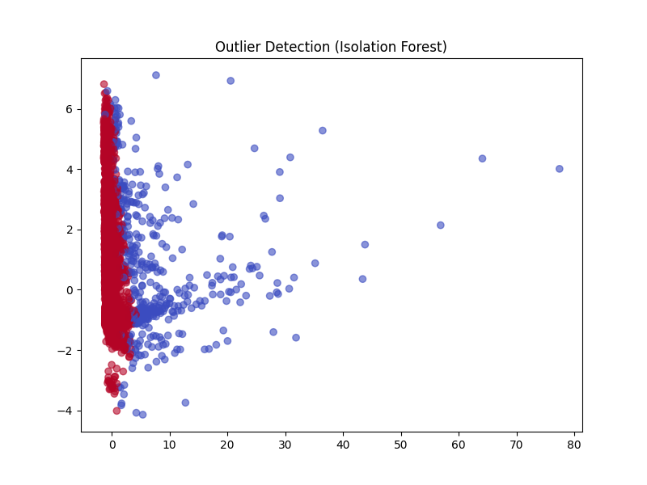
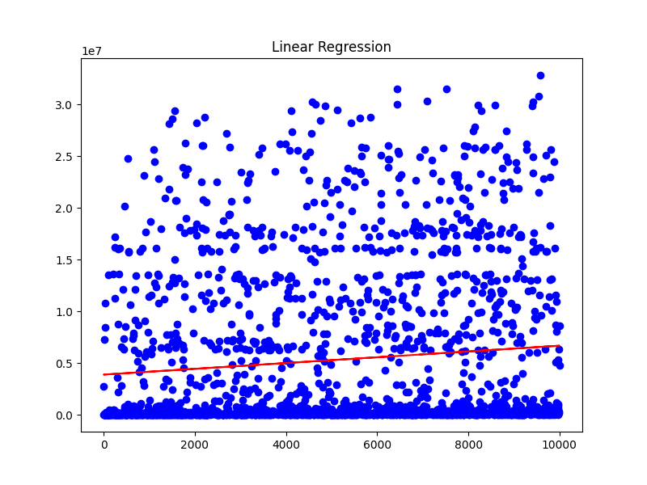

# Analysis Report

## Dataset Overview

### Summary Statistics

|                           |   count |   unique | top                                                                                      |   freq |            mean |              std |            min |             25% |              50% |             75% |              max |
|:--------------------------|--------:|---------:|:-----------------------------------------------------------------------------------------|-------:|----------------:|-----------------:|---------------:|----------------:|-----------------:|----------------:|-----------------:|
| book_id                   |   10000 |      nan | nan                                                                                      |    nan |  5000.5         |   2886.9         |     1          |  2500.75        |   5000.5         |  7500.25        |  10000           |
| goodreads_book_id         |   10000 |      nan | nan                                                                                      |    nan |     5.2647e+06  |      7.57546e+06 |     1          | 46275.8         | 394966           |     9.38223e+06 |      3.32886e+07 |
| best_book_id              |   10000 |      nan | nan                                                                                      |    nan |     5.47121e+06 |      7.82733e+06 |     1          | 47911.8         | 425124           |     9.63611e+06 |      3.55342e+07 |
| work_id                   |   10000 |      nan | nan                                                                                      |    nan |     8.64618e+06 |      1.17511e+07 |    87          |     1.00884e+06 |      2.71952e+06 |     1.45177e+07 |      5.63996e+07 |
| books_count               |   10000 |      nan | nan                                                                                      |    nan |    75.7127      |    170.471       |     1          |    23           |     40           |    67           |   3455           |
| isbn                      |    9300 |     9300 | 439023483                                                                                |      1 |   nan           |    nan           |   nan          |   nan           |    nan           |   nan           |    nan           |
| isbn13                    |    9415 |      nan | nan                                                                                      |    nan |     9.75504e+12 |      4.42862e+11 |     1.9517e+08 |     9.78032e+12 |      9.78045e+12 |     9.78083e+12 |      9.79001e+12 |
| authors                   |   10000 |     4664 | Stephen King                                                                             |     60 |   nan           |    nan           |   nan          |   nan           |    nan           |   nan           |    nan           |
| original_publication_year |    9979 |      nan | nan                                                                                      |    nan |  1981.99        |    152.577       | -1750          |  1990           |   2004           |  2011           |   2017           |
| original_title            |    9415 |     9274 |                                                                                          |      5 |   nan           |    nan           |   nan          |   nan           |    nan           |   nan           |    nan           |
| title                     |   10000 |     9964 | Selected Poems                                                                           |      4 |   nan           |    nan           |   nan          |   nan           |    nan           |   nan           |    nan           |
| language_code             |    8916 |       25 | eng                                                                                      |   6341 |   nan           |    nan           |   nan          |   nan           |    nan           |   nan           |    nan           |
| average_rating            |   10000 |      nan | nan                                                                                      |    nan |     4.00219     |      0.254427    |     2.47       |     3.85        |      4.02        |     4.18        |      4.82        |
| ratings_count             |   10000 |      nan | nan                                                                                      |    nan | 54001.2         | 157370           |  2716          | 13568.8         |  21155.5         | 41053.5         |      4.78065e+06 |
| work_ratings_count        |   10000 |      nan | nan                                                                                      |    nan | 59687.3         | 167804           |  5510          | 15438.8         |  23832.5         | 45915           |      4.94236e+06 |
| work_text_reviews_count   |   10000 |      nan | nan                                                                                      |    nan |  2919.96        |   6124.38        |     3          |   694           |   1402           |  2744.25        | 155254           |
| ratings_1                 |   10000 |      nan | nan                                                                                      |    nan |  1345.04        |   6635.63        |    11          |   196           |    391           |   885           | 456191           |
| ratings_2                 |   10000 |      nan | nan                                                                                      |    nan |  3110.89        |   9717.12        |    30          |   656           |   1163           |  2353.25        | 436802           |
| ratings_3                 |   10000 |      nan | nan                                                                                      |    nan | 11475.9         |  28546.4         |   323          |  3112           |   4894           |  9287           | 793319           |
| ratings_4                 |   10000 |      nan | nan                                                                                      |    nan | 19965.7         |  51447.4         |   750          |  5405.75        |   8269.5         | 16023.5         |      1.4813e+06  |
| ratings_5                 |   10000 |      nan | nan                                                                                      |    nan | 23789.8         |  79768.9         |   754          |  5334           |   8836           | 17304.5         |      3.01154e+06 |
| image_url                 |   10000 |     6669 | https://s.gr-assets.com/assets/nophoto/book/111x148-bcc042a9c91a29c1d680899eff700a03.png |   3332 |   nan           |    nan           |   nan          |   nan           |    nan           |   nan           |    nan           |
| small_image_url           |   10000 |     6669 | https://s.gr-assets.com/assets/nophoto/book/50x75-a91bf249278a81aabab721ef782c4a74.png   |   3332 |   nan           |    nan           |   nan          |   nan           |    nan           |   nan           |    nan           |

### Missing Values

|                           |   Missing Values |
|:--------------------------|-----------------:|
| book_id                   |                0 |
| goodreads_book_id         |                0 |
| best_book_id              |                0 |
| work_id                   |                0 |
| books_count               |                0 |
| isbn                      |              700 |
| isbn13                    |              585 |
| authors                   |                0 |
| original_publication_year |               21 |
| original_title            |              585 |
| title                     |                0 |
| language_code             |             1084 |
| average_rating            |                0 |
| ratings_count             |                0 |
| work_ratings_count        |                0 |
| work_text_reviews_count   |                0 |
| ratings_1                 |                0 |
| ratings_2                 |                0 |
| ratings_3                 |                0 |
| ratings_4                 |                0 |
| ratings_5                 |                0 |
| image_url                 |                0 |
| small_image_url           |                0 |

## Correlation Analysis

### Correlation Matrix

|                           |    book_id |   goodreads_book_id |   best_book_id |    work_id |   books_count |      isbn13 |   original_publication_year |   average_rating |   ratings_count |   work_ratings_count |   work_text_reviews_count |   ratings_1 |   ratings_2 |   ratings_3 |   ratings_4 |   ratings_5 |
|:--------------------------|-----------:|--------------------:|---------------:|-----------:|--------------:|------------:|----------------------------:|-----------------:|----------------:|---------------------:|--------------------------:|------------:|------------:|------------:|------------:|------------:|
| book_id                   |  1         |           0.115154  |      0.104516  |  0.113861  |    -0.263841  | -0.011291   |                  0.0498747  |      -0.0408798  |     -0.373178   |          -0.382656   |               -0.419292   | -0.239401   |  -0.345764  |  -0.413279  |  -0.407079  | -0.332486   |
| goodreads_book_id         |  0.115154  |           1         |      0.96662   |  0.929356  |    -0.164578  | -0.048246   |                  0.13379    |      -0.0248484  |     -0.073023   |          -0.0637601  |                0.118845   | -0.0383752  |  -0.0565712 |  -0.075634  |  -0.0633104 | -0.0561447  |
| best_book_id              |  0.104516  |           0.96662   |      1         |  0.899258  |    -0.15924   | -0.0472525  |                  0.131442   |      -0.021187   |     -0.0691819  |          -0.0558346  |                0.125893   | -0.0338938  |  -0.0492842 |  -0.0670141 |  -0.054462  | -0.0495245  |
| work_id                   |  0.113861  |           0.929356  |      0.899258  |  1         |    -0.109436  | -0.0393198  |                  0.107972   |      -0.0175554  |     -0.0627204  |          -0.0547121  |                0.0969853  | -0.0345903  |  -0.0513668 |  -0.0667459 |  -0.0547754 | -0.0467453  |
| books_count               | -0.263841  |          -0.164578  |     -0.15924   | -0.109436  |     1         |  0.0178649  |                 -0.321753   |      -0.0698883  |      0.324235   |           0.333664   |                0.198698   |  0.225763   |   0.334923  |   0.383699  |   0.349564  |  0.279559   |
| isbn13                    | -0.011291  |          -0.048246  |     -0.0472525 | -0.0393198 |     0.0178649 |  1          |                 -0.00461214 |      -0.0256669  |      0.00890359 |           0.00916556 |                0.00955286 |  0.00605369 |   0.0103455 |   0.0121425 |   0.0101608 |  0.00662185 |
| original_publication_year |  0.0498747 |           0.13379   |      0.131442  |  0.107972  |    -0.321753  | -0.00461214 |                  1          |       0.0156076  |     -0.0244147  |          -0.0254478  |                0.0277841  | -0.019635   |  -0.0384716 |  -0.0424592 |  -0.0257847 | -0.0153877  |
| average_rating            | -0.0408798 |          -0.0248484 |     -0.021187  | -0.0175554 |    -0.0698883 | -0.0256669  |                  0.0156076  |       1          |      0.0449904  |           0.0450416  |                0.00748112 | -0.0779966  |  -0.115875  |  -0.0652372 |   0.0361082 |  0.115412   |
| ratings_count             | -0.373178  |          -0.073023  |     -0.0691819 | -0.0627204 |     0.324235  |  0.00890359 |                 -0.0244147  |       0.0449904  |      1          |           0.995068   |                0.779635   |  0.723144   |   0.845949  |   0.935193  |   0.978869  |  0.964046   |
| work_ratings_count        | -0.382656  |          -0.0637601 |     -0.0558346 | -0.0547121 |     0.333664  |  0.00916556 |                 -0.0254478  |       0.0450416  |      0.995068   |           1          |                0.807009   |  0.718718   |   0.848581  |   0.941182  |   0.987764  |  0.966587   |
| work_text_reviews_count   | -0.419292  |           0.118845  |      0.125893  |  0.0969853 |     0.198698  |  0.00955286 |                  0.0277841  |       0.00748112 |      0.779635   |           0.807009   |                1          |  0.572007   |   0.69688   |   0.762214  |   0.817826  |  0.76494    |
| ratings_1                 | -0.239401  |          -0.0383752 |     -0.0338938 | -0.0345903 |     0.225763  |  0.00605369 |                 -0.019635   |      -0.0779966  |      0.723144   |           0.718718   |                0.572007   |  1          |   0.92614   |   0.795364  |   0.672986  |  0.597231   |
| ratings_2                 | -0.345764  |          -0.0565712 |     -0.0492842 | -0.0513668 |     0.334923  |  0.0103455  |                 -0.0384716  |      -0.115875   |      0.845949   |           0.848581   |                0.69688    |  0.92614    |   1         |   0.949596  |   0.838298  |  0.705747   |
| ratings_3                 | -0.413279  |          -0.075634  |     -0.0670141 | -0.0667459 |     0.383699  |  0.0121425  |                 -0.0424592  |      -0.0652372  |      0.935193   |           0.941182   |                0.762214   |  0.795364   |   0.949596  |   1         |   0.952998  |  0.82555    |
| ratings_4                 | -0.407079  |          -0.0633104 |     -0.054462  | -0.0547754 |     0.349564  |  0.0101608  |                 -0.0257847  |       0.0361082  |      0.978869   |           0.987764   |                0.817826   |  0.672986   |   0.838298  |   0.952998  |   1         |  0.933785   |
| ratings_5                 | -0.332486  |          -0.0561447 |     -0.0495245 | -0.0467453 |     0.279559  |  0.00662185 |                 -0.0153877  |       0.115412   |      0.964046   |           0.966587   |                0.76494    |  0.597231   |   0.705747  |   0.82555   |   0.933785  |  1          |

## Clustering Analysis

Clustering performed using PCA and t-SNE.

## Outlier Detection

Outlier detection performed using Isolation Forest.

## Regression Analysis

|       |   Mean Squared Error |   R2 Score |
|:------|---------------------:|-----------:|
| Value |          5.95767e+13 |  0.0191922 |

## Conclusion

Error generating narrative.
