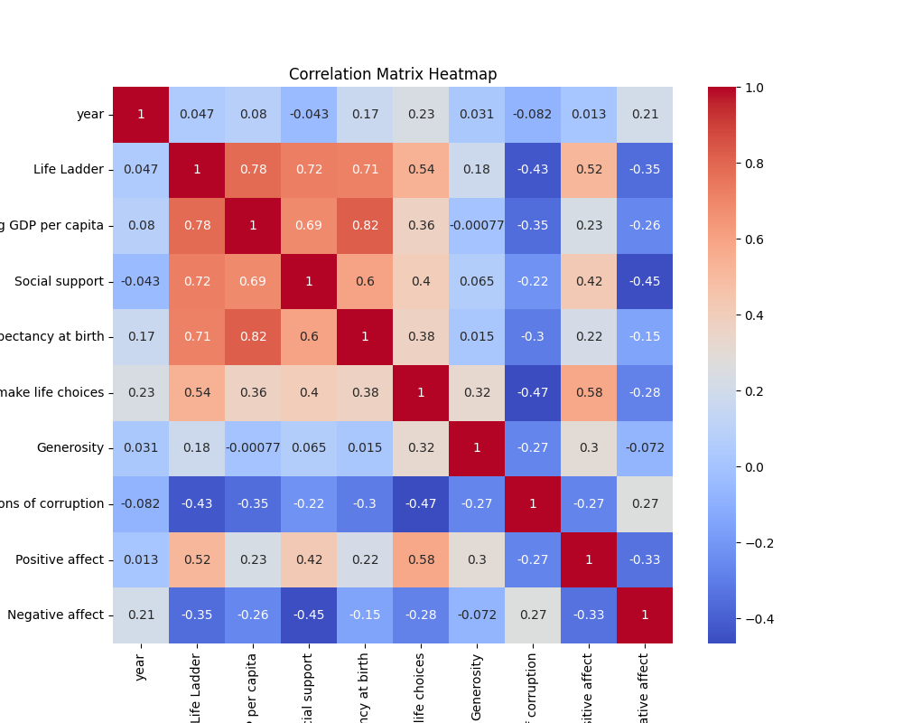
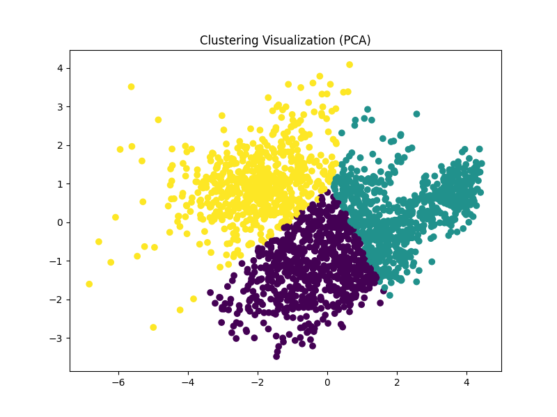
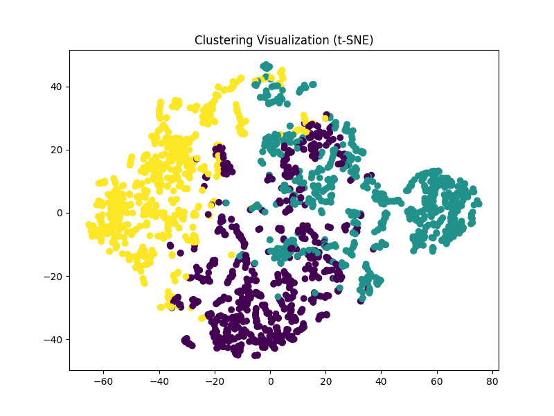
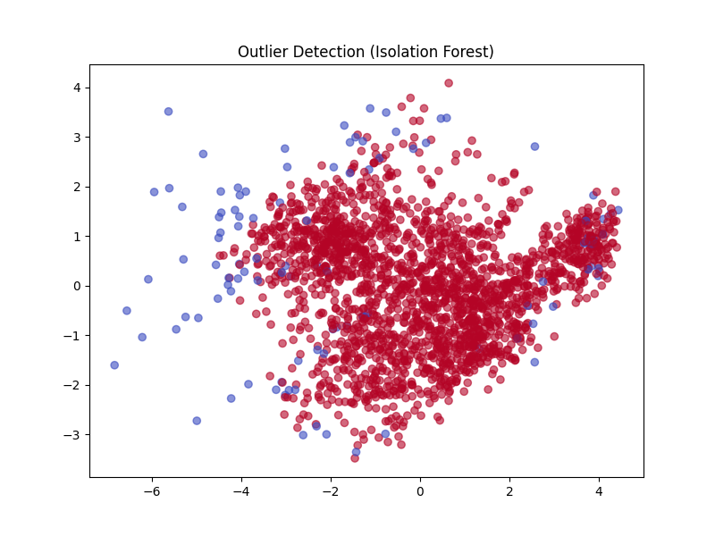
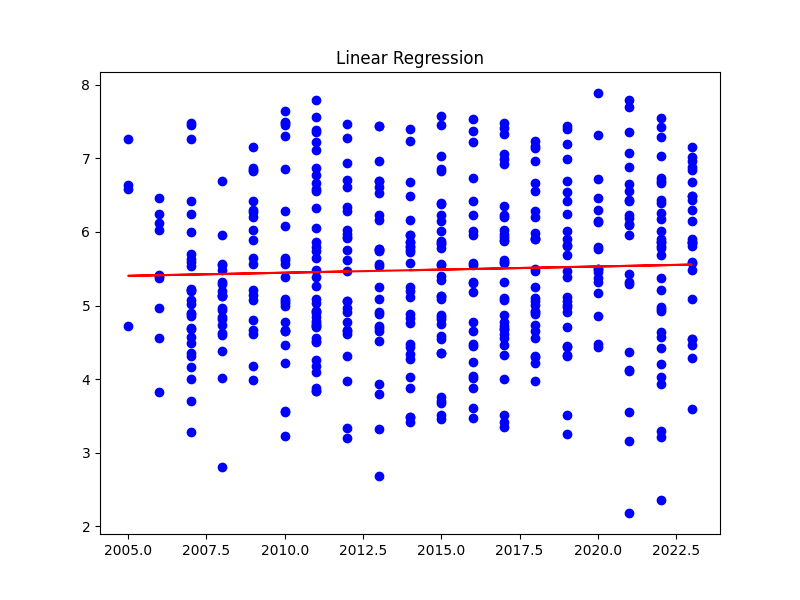

# Analysis Report

## Dataset Overview

### Summary Statistics

|                                  |   count |   unique | top     |   freq |           mean |         std |      min |       25% |       50% |        75% |      max |
|:---------------------------------|--------:|---------:|:--------|-------:|---------------:|------------:|---------:|----------:|----------:|-----------:|---------:|
| Country name                     |    2363 |      165 | Lebanon |     18 |  nan           | nan         |  nan     |  nan      |  nan      |  nan       |  nan     |
| year                             |    2363 |      nan | nan     |    nan | 2014.76        |   5.05944   | 2005     | 2011      | 2015      | 2019       | 2023     |
| Life Ladder                      |    2363 |      nan | nan     |    nan |    5.48357     |   1.12552   |    1.281 |    4.647  |    5.449  |    6.3235  |    8.019 |
| Log GDP per capita               |    2335 |      nan | nan     |    nan |    9.39967     |   1.15207   |    5.527 |    8.5065 |    9.503  |   10.3925  |   11.676 |
| Social support                   |    2350 |      nan | nan     |    nan |    0.809369    |   0.121212  |    0.228 |    0.744  |    0.8345 |    0.904   |    0.987 |
| Healthy life expectancy at birth |    2300 |      nan | nan     |    nan |   63.4018      |   6.84264   |    6.72  |   59.195  |   65.1    |   68.5525  |   74.6   |
| Freedom to make life choices     |    2327 |      nan | nan     |    nan |    0.750282    |   0.139357  |    0.228 |    0.661  |    0.771  |    0.862   |    0.985 |
| Generosity                       |    2282 |      nan | nan     |    nan |    9.77213e-05 |   0.161388  |   -0.34  |   -0.112  |   -0.022  |    0.09375 |    0.7   |
| Perceptions of corruption        |    2238 |      nan | nan     |    nan |    0.743971    |   0.184865  |    0.035 |    0.687  |    0.7985 |    0.86775 |    0.983 |
| Positive affect                  |    2339 |      nan | nan     |    nan |    0.651882    |   0.10624   |    0.179 |    0.572  |    0.663  |    0.737   |    0.884 |
| Negative affect                  |    2347 |      nan | nan     |    nan |    0.273151    |   0.0871311 |    0.083 |    0.209  |    0.262  |    0.326   |    0.705 |

### Missing Values

|                                  |   Missing Values |
|:---------------------------------|-----------------:|
| Country name                     |                0 |
| year                             |                0 |
| Life Ladder                      |                0 |
| Log GDP per capita               |               28 |
| Social support                   |               13 |
| Healthy life expectancy at birth |               63 |
| Freedom to make life choices     |               36 |
| Generosity                       |               81 |
| Perceptions of corruption        |              125 |
| Positive affect                  |               24 |
| Negative affect                  |               16 |

## Correlation Analysis

### Correlation Matrix

|                                  |       year |   Life Ladder |   Log GDP per capita |   Social support |   Healthy life expectancy at birth |   Freedom to make life choices |   Generosity |   Perceptions of corruption |   Positive affect |   Negative affect |
|:---------------------------------|-----------:|--------------:|---------------------:|-----------------:|-----------------------------------:|-------------------------------:|-------------:|----------------------------:|------------------:|------------------:|
| year                             |  1         |     0.0468461 |          0.0801038   |       -0.0430737 |                          0.168026  |                       0.232974 |  0.0308644   |                  -0.0821355 |         0.0130525 |         0.207642  |
| Life Ladder                      |  0.0468461 |     1         |          0.783556    |        0.722738  |                          0.714927  |                       0.53821  |  0.177398    |                  -0.430485  |         0.515283  |        -0.352412  |
| Log GDP per capita               |  0.0801038 |     0.783556  |          1           |        0.685329  |                          0.819326  |                       0.364816 | -0.000765985 |                  -0.353893  |         0.230868  |        -0.260689  |
| Social support                   | -0.0430737 |     0.722738  |          0.685329    |        1         |                          0.597787  |                       0.404131 |  0.0652399   |                  -0.22141   |         0.424524  |        -0.454878  |
| Healthy life expectancy at birth |  0.168026  |     0.714927  |          0.819326    |        0.597787  |                          1         |                       0.375745 |  0.0151682   |                  -0.30313   |         0.217982  |        -0.15033   |
| Freedom to make life choices     |  0.232974  |     0.53821   |          0.364816    |        0.404131  |                          0.375745  |                       1        |  0.321396    |                  -0.466023  |         0.578398  |        -0.278959  |
| Generosity                       |  0.0308644 |     0.177398  |         -0.000765985 |        0.0652399 |                          0.0151682 |                       0.321396 |  1           |                  -0.270004  |         0.300608  |        -0.0719746 |
| Perceptions of corruption        | -0.0821355 |    -0.430485  |         -0.353893    |       -0.22141   |                         -0.30313   |                      -0.466023 | -0.270004    |                   1         |        -0.274208  |         0.265555  |
| Positive affect                  |  0.0130525 |     0.515283  |          0.230868    |        0.424524  |                          0.217982  |                       0.578398 |  0.300608    |                  -0.274208  |         1         |        -0.334451  |
| Negative affect                  |  0.207642  |    -0.352412  |         -0.260689    |       -0.454878  |                         -0.15033   |                      -0.278959 | -0.0719746   |                   0.265555  |        -0.334451  |         1         |

## Clustering Analysis

Clustering performed using PCA and t-SNE.

## Outlier Detection

Outlier detection performed using Isolation Forest.

## Regression Analysis

|       |   Mean Squared Error |   R2 Score |
|:------|---------------------:|-----------:|
| Value |              1.25079 | 0.00462067 |

## Conclusion

Error generating narrative.
