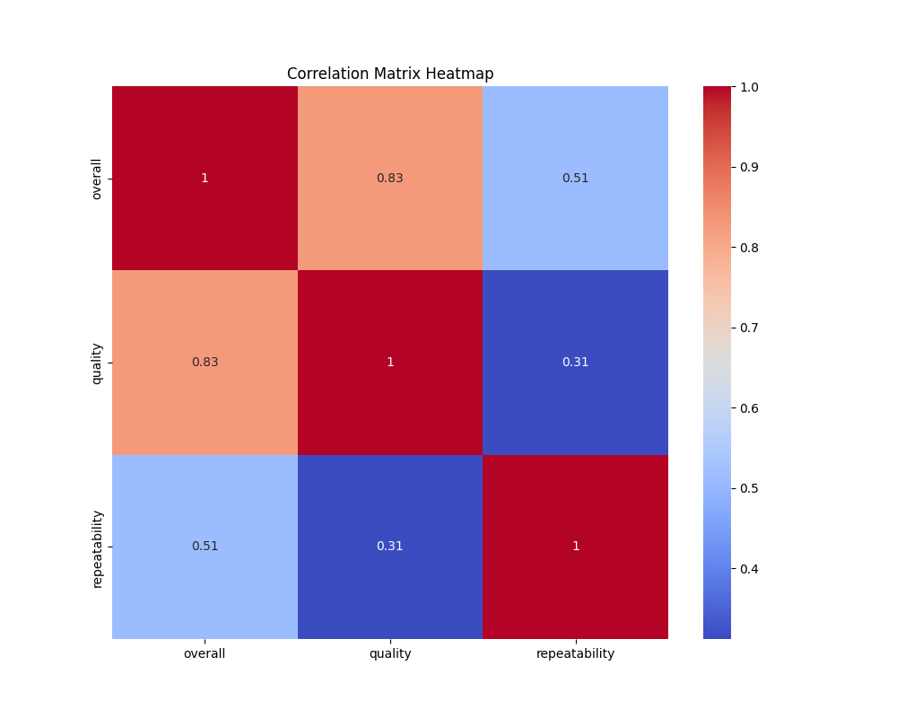
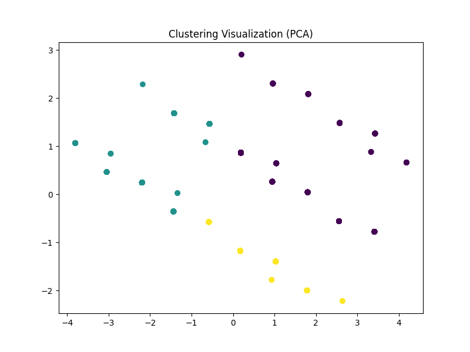
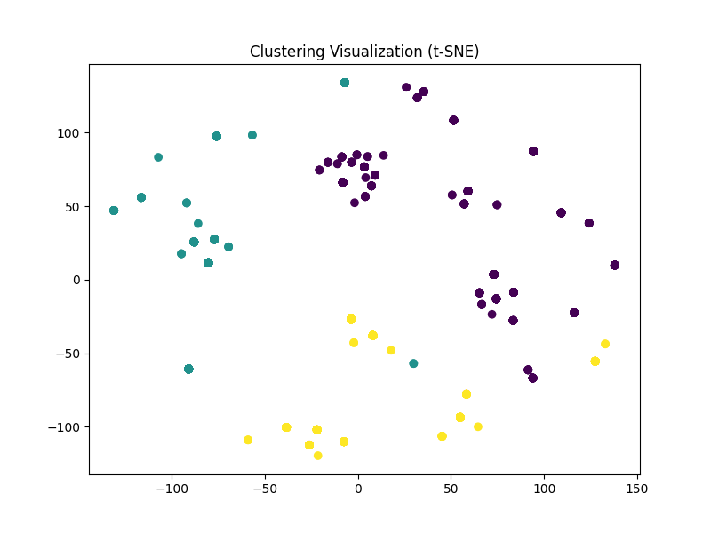
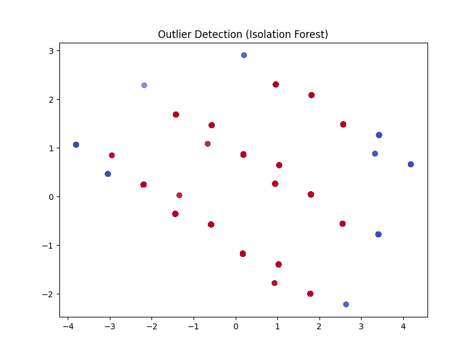
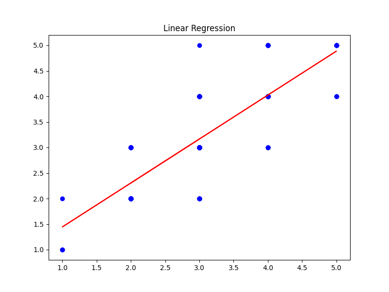

# Analysis Report

## Dataset Overview

### Summary Statistics

|               |   count |   unique | top               |   freq |      mean |        std |   min |   25% |   50% |   75% |   max |
|:--------------|--------:|---------:|:------------------|-------:|----------:|-----------:|------:|------:|------:|------:|------:|
| date          |    2553 |     2055 | 21-May-06         |      8 | nan       | nan        |   nan |   nan |   nan |   nan |   nan |
| language      |    2652 |       11 | English           |   1306 | nan       | nan        |   nan |   nan |   nan |   nan |   nan |
| type          |    2652 |        8 | movie             |   2211 | nan       | nan        |   nan |   nan |   nan |   nan |   nan |
| title         |    2652 |     2312 | Kanda Naal Mudhal |      9 | nan       | nan        |   nan |   nan |   nan |   nan |   nan |
| by            |    2390 |     1528 | Kiefer Sutherland |     48 | nan       | nan        |   nan |   nan |   nan |   nan |   nan |
| overall       |    2652 |      nan | nan               |    nan |   3.04751 |   0.76218  |     1 |     3 |     3 |     3 |     5 |
| quality       |    2652 |      nan | nan               |    nan |   3.20928 |   0.796743 |     1 |     3 |     3 |     4 |     5 |
| repeatability |    2652 |      nan | nan               |    nan |   1.49472 |   0.598289 |     1 |     1 |     1 |     2 |     3 |

### Missing Values

|               |   Missing Values |
|:--------------|-----------------:|
| date          |               99 |
| language      |                0 |
| type          |                0 |
| title         |                0 |
| by            |              262 |
| overall       |                0 |
| quality       |                0 |
| repeatability |                0 |

## Correlation Analysis

### Correlation Matrix

|               |   overall |   quality |   repeatability |
|:--------------|----------:|----------:|----------------:|
| overall       |  1        |  0.825935 |        0.5126   |
| quality       |  0.825935 |  1        |        0.312127 |
| repeatability |  0.5126   |  0.312127 |        1        |

## Clustering Analysis

Clustering performed using PCA and t-SNE.

## Outlier Detection

Outlier detection performed using Isolation Forest.

## Regression Analysis

|       |   Mean Squared Error |   R2 Score |
|:------|---------------------:|-----------:|
| Value |             0.198327 |   0.676756 |

## Conclusion

Error generating narrative.
